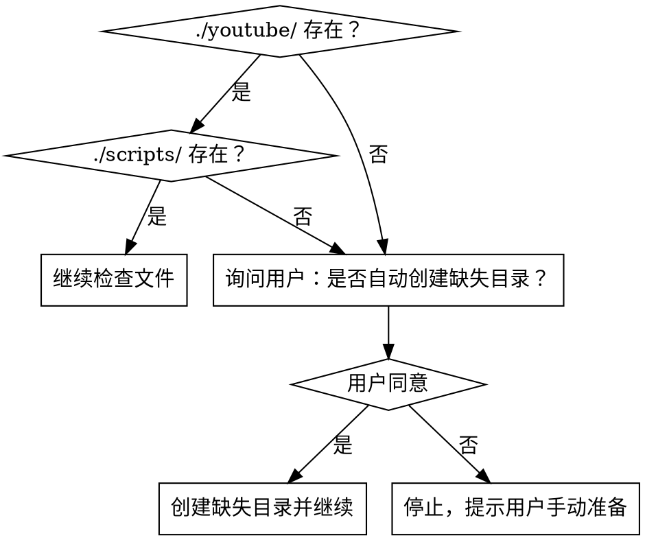
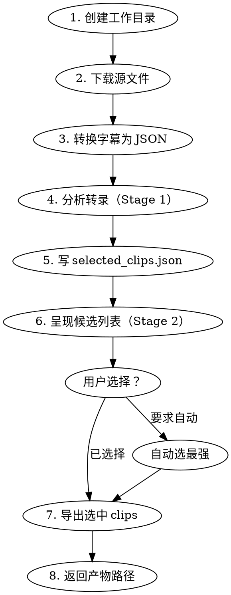

# YouTube Interview → Chinese Shorts

将一段 YouTube 访谈/播客切割成多个带中文硬字幕的短视频片段。

## 前置检查

按以下顺序检查，遇到问题先询问用户再继续：

**第一步：检查目录是否存在**

检查 `./youtube/` 和 `./scripts/` 是否存在：



自动创建时执行：
```bash
mkdir -p ./youtube ./scripts
```
并告知用户目录已创建，但仍需手动放入所需文件（见下方文件列表）。

**第二步：检查必要文件**

目录存在后，验证以下文件，任意缺失立即报告并停止：

- `./youtube/download.py`
- `./youtube/ZITI.ttf`
- `./scripts/srt_to_json.py`
- `./scripts/window_srt.py`
- `./scripts/clip_video.py`
- `./scripts/burn_subtitles.py`
- `ffmpeg` 可用（`ffmpeg -version`）

## 工作区布局（约定）

```
work/<video-slug>/
  source/
    original.mp4
    original.en.srt
    original.jpg        # 可选缩略图
  analysis/
    transcript.json
    selected_clips.json
    candidate-review.txt
    clip-packaging.txt
  clips/
    <id>-<slug>/
      clip.mp4
      clip.en.srt
      clip.zh.srt
      clip.hardsub.mp4
      metadata.txt
```

## 主流程



### 步骤详解

**1. 创建工作目录**
从 URL 提取 video-slug，创建 `work/<video-slug>/source/`、`analysis/`、`clips/`。

**2. 下载源文件**
```bash
python ./youtube/download.py <URL> --output work/<video-slug>/source/
```
识别产物：`.mp4`（源视频）、`.en.srt`（英文字幕，必须存在）、`.jpg`（可选）。
下载器依赖本地 cookies。若失败提示用户刷新 cookies，不要修改 skill。

**3. 转换字幕为 JSON**
```bash
python ./scripts/srt_to_json.py work/<video-slug>/source/original.en.srt \
  > work/<video-slug>/analysis/transcript.json
```

**4-5. 分析转录并写候选列表**
使用 `@references/analysis-prompt.md` 中的 Stage 1 提示词分析 `transcript.json`。
结果写入 `analysis/selected_clips.json`，结构遵循 `@references/clip-schema.md`。

- 1 小时视频目标 **10~15 个候选**（宁多勿少）
- 结束时间戳必须落在句子完整结束后

**6. 呈现候选列表**
使用 Stage 2 格式输出，每个片段包含：时间戳、时长、标题、两句摘要。
询问用户选择哪些 clip ids 导出。

**7. 导出每个选中的 clip**

对每个 clip 按顺序执行：

```bash
# a) 切片
python ./scripts/clip_video.py \
  --input work/<video-slug>/source/original.mp4 \
  --start <start_seconds> --end <end_seconds> \
  --output work/<video-slug>/clips/<id>-<slug>/clip.mp4

# b) 提取字幕窗口
python ./scripts/window_srt.py \
  --input work/<video-slug>/source/original.en.srt \
  --start <start_seconds> --end <end_seconds> \
  --output work/<video-slug>/clips/<id>-<slug>/clip.en.srt

# c) 翻译为中文（使用 Stage 3 提示词）
# 输出写入 clip.zh.srt

# d) 生成标题与描述（使用 Stage 4 提示词）
# 写入 metadata.txt

# e) 烧录字幕与标题
python ./scripts/burn_subtitles.py \
  --input work/<video-slug>/clips/<id>-<slug>/clip.mp4 \
  --srt work/<video-slug>/clips/<id>-<slug>/clip.zh.srt \
  --title "<屏幕叠加标题>" \
  --font ./youtube/ZITI.ttf \
  --font-size 48 --outline 3 \
  --output work/<video-slug>/clips/<id>-<slug>/clip.hardsub.mp4
```

标题叠加规则：居中、出现在视频第一秒、约 12 个中文字。

**8. 返回产物路径**
列出所有 `clip.hardsub.mp4` 路径和 `metadata.txt` 路径。

## 选片规则

**优先选择：**
- 有明确立场、反常识、有激励性、情感鲜明、适合引用的片段
- 首 3 秒内有强钩子
- 以完整思想结尾

**排除：**
- 暖场、介绍、赞助商推广
- 严重依赖前文或画面的片段
- 时长超出 20s~3min 范围的片段

## 翻译规则

- 忠实原意，改写为自然口语中文
- 保留所有时间戳，不修改
- 保留专有名词、数字、产品名称
- 保留字幕条目数量（默认失败是太少，不是太多）

## 错误契约

无法完成时，必须精确报告阻断原因：

| 阻断 | 报告内容 |
|------|----------|
| 下载失败 | cookies 是否过期、具体错误信息 |
| 无英文字幕 | 文件名列表，确认 `.en.srt` 不存在 |
| ffmpeg 缺失 | `which ffmpeg` 输出 |
| 转录质量差 | 具体不可信段落示例 |
| 脚本缺失 | 缺失的文件路径 |
